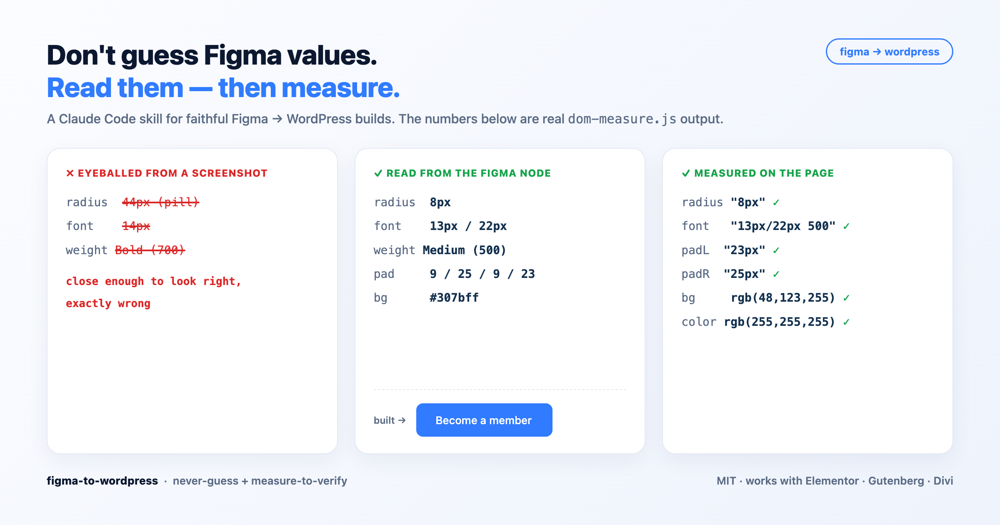

# figma-to-wordpress

**A Claude Code skill that stops the AI from guessing your Figma values.** It reads the real CSS from every node, builds it on your WordPress site, then *measures* the rendered page back against the design instead of eyeballing a screenshot.

Works with **Elementor, Gutenberg/blocks, and Divi**. Builder-agnostic at its core.

---

## The problem

Ask any AI to "build this Figma design in WordPress" and it looks at a screenshot and guesses: *"that button's about 14px, Bold, pill-shaped."* The values come out **approximately right and exactly wrong**: radius 44px when Figma says 8px, 14px when it's 13px, Bold when it's Medium. Each value is "close enough to look reasonable," so nothing trips an alarm. You ship a whole site with subtly wrong typography and corner radii, and the designer catches it in review.

## The method

Three rules, and the whole skill is built around them:

1. **Never guess, read the node.** Before stating any element's font-size / radius / padding / colour, pull it from that exact Figma node (`get_design_context`), not from a screenshot.
2. **Extract assets as SVG.** Icons and logos come out of the Figma REST API as real vectors (`format=svg`), not rasterized PNGs that blur on retina.
3. **Verify by measuring.** After building, read the rendered DOM's actual `getBoundingClientRect()` / `getComputedStyle()` and diff it against the Figma geometry. The diff *is* your fix list. Screenshots are for gross structure only.

The result: pages converge in 1-2 measure cycles instead of 5-8 eyeball-the-screenshot cycles, and they're right the first time far more often.

## How it works



*A naive AI eyeballs the screenshot and guesses (left). This skill reads the exact values from the Figma node (middle), then **proves** the build matches by measuring the rendered DOM (right). Those are real `dom-measure.js` numbers, not a mockup.*

---

## Setup

```bash
# 1. install the skill
git clone https://github.com/MatasMartin/figma-to-wordpress.git
cp -r figma-to-wordpress ~/.claude/skills/figma-to-wordpress

# 2. connect the Figma MCP (reads exact per-node specs - the never-guess engine)
claude mcp add --scope user --transport http figma https://mcp.figma.com/mcp
#    then authenticate inside Claude Code: run mcp__figma__authenticate and click the URL

# 3. set a read-only Figma REST token (used for batch SVG / asset export)
#    Figma -> Settings -> Personal access tokens, scopes: file_content:read + file_metadata:read
export FIGMA_PAT="figd_your_token_here"

# 4. install headless Chromium (used by the measure / verify scripts)
npx playwright install chromium
```

There are **two Figma connections** and they do different jobs: the **MCP** reads each element's exact spec (the core of never-guess), and the **REST token** (`$FIGMA_PAT`) is for batch-exporting assets as SVG. You want both.

You also need a **local WordPress** environment for the fast path ([LocalWP](https://localwp.com/) is the easiest; DDEV works too). The manual builder path needs only wp-admin, but you lose the measure loop.

## Your first page, start to finish

This is the whole flow, from "skill installed" to "page done." For an existing client site:

**1. Get the site running locally.** You can't run the measure loop against the live site. Pull it down: install [LocalWP](https://localwp.com/), then use the free **All-in-One WP Migration** plugin to export the live site and import it into a fresh LocalWP site. Note the local URL (something like `http://localhost:10003`). (For a brand-new site, just create a blank LocalWP site.)

**2. Open Claude Code and let it find your toolchain.** Start `claude` in a working folder, then run the detect script once so it knows your php / mysql / chromium paths and the right database socket:
```bash
bash ~/.claude/skills/figma-to-wordpress/scripts/env-detect.sh --url localhost:10003
```

**3. Grab the Figma frame.** In Figma, right-click the page frame you're building and choose **Copy link to selection**. The URL contains `?node-id=X-Y`, which is the exact node the skill will read.

**4. Tell Claude to build it.** Name the builder, the local URL, and paste the Figma link:
> "Build the Contact page from this Figma frame on my Elementor site at localhost:10003: `https://figma.com/design/...?node-id=12-345`"

That phrasing activates the skill (it triggers on things like *"Figma to WordPress"*, *"build WordPress page from Figma"*).

**5. Let the skill run.** From here it: reconnoitres the page and builder, reads the frame's metadata, pulls **per-node specs** for each element (never guessing), **exports icons/logos as SVG** via the REST API, generates the builder markup, injects it, **regenerates the cache** (skip that and a real fix looks invisible), then **measures the rendered page against Figma** and fixes the deltas. You watch and steer; you don't hand-type CSS values.

**6. Review it for real.** The skill runs an overflow sweep and `dom-measure` across widths. Open the local URL yourself and check it at desktop **and** ~390px mobile, band by band. Trust the measured numbers over a thumbnail.

**7. Show your boss / client.** LocalWP's **Live Link** gives a temporary public URL you can share without deploying.

**8. Go live when approved.** Follow [`references/going-live.md`](references/going-live.md) for the LocalWP-to-host deploy (it covers the traps: upload limits, SSL, cache, SMTP, the password-hash lockout).

Repeat for the next page. Page two onward is faster because the skill reuses the generator it already debugged on page one.

## What's inside

```
SKILL.md                     the method: never-guess rule, build loop, verification gates
references/
  figma-rest.md              Figma REST API: token setup, batch SVG / asset export
  environment.md             find your LocalWP socket, php/mysql/chromium paths
  gotchas-general.md         25 builder-agnostic traps (cache, CSS specificity, migration, fonts)
  tool-reference.md          LocalWP, AIOWPM, Figma MCP+REST, Playwright, Safe SVG
  going-live.md              deploy a local build to a live host, end to end
  builders/
    elementor.md             where Elementor stores content + how to apply the method
    gutenberg.md             block markup + mapping Figma tokens to theme.json
    divi.md                  Divi shortcodes + drop-in templates
scripts/
  env-detect.sh              detect toolchain + the right LocalWP socket
  figma-geom.py              pull frame-relative geometry from Figma (for measuring)
  figma-build-diff.py        Figma-anchored layout diff (diagnostic)
  dom-measure.js             measure a rendered element vs its spec values
  overflow-sweep.js          multi-viewport horizontal-overflow gate
  lib-playwright.js          shared headless-Chromium helper (auto-installs)
```

## Requirements

- **Claude Code** (this is a skill for it).
- **Figma** access, the [Figma MCP](https://mcp.figma.com/mcp) connected, and a read-only REST token (`$FIGMA_PAT`).
- A **local WordPress** environment ([LocalWP](https://localwp.com/) or DDEV) for the fast code-gen path. The manual builder path needs only wp-admin.
- **Node** + **Python 3** for the verification scripts (`playwright-core` auto-installs on first run; Chromium via `npx playwright install chromium`).

## Supported builders

Elementor (classic widgets), Gutenberg / Full Site Editing, and Divi 4 each have a dedicated note. The two core disciplines, never-guess and measure-to-verify, are builder-agnostic, so the method also works on Bricks, Oxygen, or a custom theme. Only *where content is stored* changes.

## License

MIT (c) 2026 Matas Martinavičius
